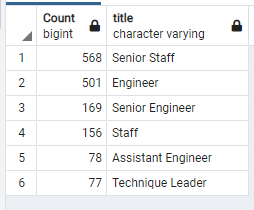

# Pewlett-Hackard-Analysis

## Project Overview
Pewlett Hackard(PH) is a large company that has been around for a very long time. They have a diverse work force boasting many thousands of employees in different business units. PH understands that many baby boomers currently in their employment will begin to retire and the rate of retirement is expected to increase at a rapid rate. As such, PH is looking to ensure they are prepared for this eventuallity by understanding who will qualify for retirement packages and which positions will need to be filled. Some department managers have proposed offering part-time roles to employees who qualify as mentors so they can act as advisors to newly hired employees. Currently, the information used for this analysis resides in Excel/VBA and PH has decided to migrate to a pdAdmin/Postgres database solution to find answers to the challenges outlined. By upgrading their methods for analysis, PH is hoping to utilize SQL as a tool to prepare analytical reports and look for possible solutions and recommendations.

- Deliverables:
  1. Determine the number of retiring employees by title
  2. Identify employees who are eligible to be in the mentorship program
---------------------------

## Resources
- Database Client: pgAdmin v5.2
- Database Server: PostgreSQL v13
- CSV Files created: retirement_titles.csv, unique_titles.csv, retiring_titles.csv, mentorship_eligibility.csv, mentor_roles.csv
- Software: Visual Studio Code 1.56.2
---------------------------

## Results

To prepare the different analyses, the original data was loaded into different database tables and relationships establised to give us a working understanding of the database structure. The following entity relationship diagram(ERD) was designed to provide implementation guidance and as a documentary guide for future reference.

### Retiring Employees by Title

- From the list below we are able to determine that there are 90,398 employees who meet the criteria for the retirement package. A summary list and a sample list are both provided below for reference.
- A closer examination shows that 63.8% of employees are either Senior Staff or Senior Engineers. These employees have a lot shared knowledge and it would be wise to have them transfer as much information as possible to new employees or their junior counterparts.
- It should also be noted that there are 2 managers who are likewise eligible for retirement. As this is a leadership position it is important that new managers are vetted and become understudies as soon as possible to ensure that proper leadership is in place to ensure a smooth transition. In order to execute an effective retiring/hiring process it is very important to have a management team in place in the different business units.

### Employee Groups Qualifying for the Retirement Package

### Sample of Employees

### Mentorship Eligibility

- Based on the criteria provided, there are 1549 qualified mentors found in current employment at PH. A sample list of these employees is shown below.
- Six of the seven different groups are represented in the list, with no managers qualifying as mentors.
- The mentor eligibility criteria may need to be expanded so PH can have more employees in the mentors pool for assignments.

### Eligible Employees who Qualify as Mentors

---------------------------

## Summary Analysis

- Eventually 90,398 new roles will need to be filled for PH as the impact of retirement begins to unfold.
- Of specific note when analyzing the different employee groups, we can see that there are four departments that do not currently have a manager allocated in a leadership position.
- Further, 2 of the 5 current managers are eligible for the retirement package as listed below.
- It is imperative that new and qualified managerial candiates be identified and placed into these position as soon as possible. Managerial input for each business unit will be a necessity in job assignments and allocating mentors in a suitable manner.

### Managers by Department

### Managers Qualifying for Retirement

- Of the 1,549 employees who qualify as retirement-ready mentors from the list below, the following breakdown outlines the different roles they are able to provide mentorship for PH.
- Generally, it appears that there is a good level of coverage amongst the different business units.
- Each employee group is represented except the manager group as noted previously.

### Mentors by Title

- Further analysis shows us that if all employees accepted mentorship positions they will have the following ratios of new employees to actively advise.
- We can clearly see that the Sr. Engineer position should be a point of emphasis as there is a ratio of 1 mentor for a possible 174 new employees. Viable considerations would be to change the mentorship criteria or seek mentors outside of PH in the broader engineering business community.
- Likewise we have no managerial mentors available to advise new managers.

### Mentorship to New Employee Ratio

Title               | Mentorship ratio  |
--------------------|--------------------
 Sr. Engineer       | 1 to 174          |
 Sr. Staff          | 1 to 50           |
 Engineer           | 1 to 28           |
 Staff              | 1 to 79           |
 Technique Leader   | 1 to 59           |
 Assistant Engineer | 1 to 23           |
 Manager            | zero              |
 ----------------------------------------