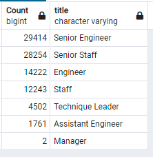

# Pewlett-Hackard-Analysis

## Project Overview
Pewlett Hackard(PH) is a large company that has been around for a very long time. They have a diverse work force boasting many thousands of employees. PH understands that many baby boomers currently in their employment will begin to retire and the rate of retirement is expected to increase at a rapid rate. As such, PH is looking to ensure they are prepared for this eventuallity by understanding who will qualify for retirement packages and which positions will need to be filled. Some department managers have proposed offering part-time roles to retirees so they can act as mentors to newly hired employees. Currently the information resides in Excel and VBA and PH has decided to use a pdAdmin/Postgres database solution to find answers to the challenges outlined. By upgrading their methods for analysis, PH is hoping to utilize SQL as a tool to look for possible solutions and recommendations.

- Deliverables:
  1. Determine the number of retiring employees by title
  2. Identify employees who are eligible to be in the mentorship program

## Resources
- Database Client: pgAdmin v5.2
- Database Server: PostgreSQL v13
- CSV Files created: retirement_titles.csv, unique_titles.csv, retiring_titles.csv, mentorship_eligibility.csv
- Software: Visual Studio Code 1.56.2

## Results

To prepare the analysis the original data was loaded into different database tables and relationships establised to give us a working understanding of the entity relationship diagram shown below.

### Retiring Employees by Title

- From the list below we are able to determine that there are 90,398 employees who will be retiring. A closer examination shows that 63.8% of employees are either Senior Staff or Senior Engineers

- Shows a sample list of employees by name

### Employees Eligible for Mentorship

- There are 

- point 3
- point 4

## Overall Summary
- How many roles will need to be filled as the "silver tsunami" begins to make an impact?

- Are there enough qualified, retirement-ready employees in the departments to mentor the next generation of Pewlett Hackard employees?

- Of the employees who qualify for mentorship the following breakdown outlines the different roles where a person are qualified to mentor: 

- Further analysis shows us that if all Mentors accepted positions they will have the following ratios for new employees to deal with.

Title               | Mentorship ratio  |
--------------------|--------------------
 Sr. Engineer       | 1 to 174          |
 Sr. Staff          | 1 to 50           |
 Engineer           | 1 to 28           |
 Staff              | 1 to 79           |
 Technique Leader   | 1 to 59           |
 Assistant Engineer | 1 to 23           |
 Manager            | zero              |
 ----------------------------------------

## Recommendations: